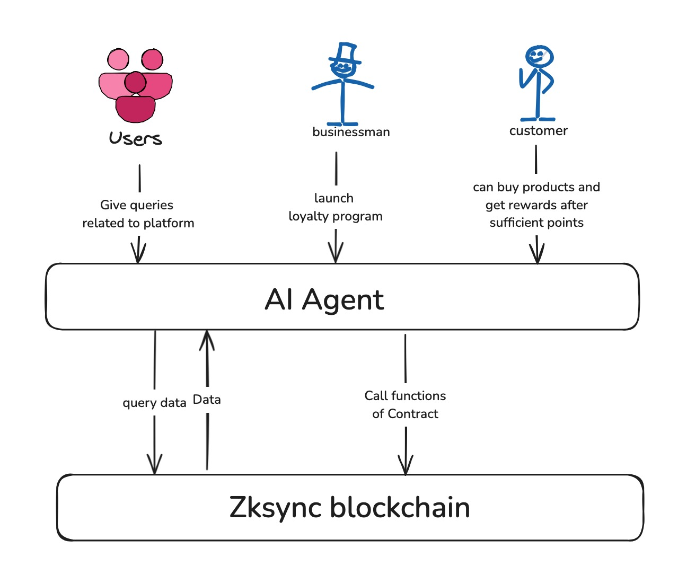

# FideX

A decentralized loyalty platform where business owners can register loyalty porgrams for their business, which will be operated by ai-assistants for seamless onboarding over the ZKSync blockchain.

## Video Demo

https://www.loom.com/share/02b52cc987e44ec3a60c71bf557f53cf

## Inspiration

The inspiration behind this platform comes from the need to modernize and decentralize loyalty programs. Traditional reward systems are often fragmented, restrictive, and lack transparency. By leveraging the ZKSync Protocol , we empower businesss to create seamless, fair, and interoperable loyalty programs. Users can earn and redeem rewards effortlessly while ensuring security and trust through blockchain technology. Our goal is to abstract customer engagement by making loyalty programs more accessible, transparent, and rewarding for both businesses and consumers.

## System Design



## Getting started

### Execute the ai-assistant backend:

```bash
# Create the suitable conda env
conda create -n ai-assistant python=3.11
conda activate ai-assistant

pip install poetry
poetry install

# Run the python backend
cd ai-assistant/ai
poetry run python3 src/main.py
```

Give the llm url in file general.yaml under folder ai-assistant/ai/config

### Start the frontend:

```bash

# Install dependencies
yarn

# Start the development server
yarn dev
```

## What it does

Fidex is a decentralised loayalty program platform that allows businesses to:

- Create and manage their own loyalty programs on the blockchain
- Set custom reward thresholds and amounts
- Track customer transactions and points
- Integrate with an AI powered chat interface for seamless customer interactions

Customers can:

- Earn points across multiple businesses with a single wallet
- View their points balance and rewards
- Interact with businesses through an AI chat interface
- Redeem rewards automatically through smart contracts

## Challenges we ran into

- Handling/catching real time event emissions from the smart contracts
- Finetuning the ai assistant as per our platform's requirements.
- Creating a seamless UX that bridges Web2 and Web3

## What's next for Fidex

- Enhanced AI capabilities: Implement personalized recommendation systems that analyze customer purchase history and preferences to suggest relevant products and optimize reward strategies.
- Cross-business rewards: Enable businesses to form partnerships and allow customers to earn and redeem points across multiple participating merchants.
-

## Contributing

We welcome contributions to enhance and expand our platform! If you're passionate about Web3, decentralized applications, or event management, join us in building the future of event hosting.

Fork this repository. Create a feature branch (git checkout -b feature-name). Submit a pull request with your changes.
